# Auto-Cybersecurity-Compliance-AI
This repository documents my journey in building **AI Agents** to automate compliance gap analysis and Threat Analysis and Risk Assessment (TARA).
# ISO/SAE 21434 Study Notes & Interpretation

## 📌 Overview
**Goal:** Map the cybersecurity engineering requirements to my existing Quality Management (QM) experience.
**Status:** In Progress 🚧

## 🟢 Clause 5: Organizational Cybersecurity Management
> *My Takeaway:* This is similar to the "Quality Management System" in IATF 16949 but for Security.

* **Cybersecurity Policy:** Top management must sign off. (Just like Quality Policy).
* **Roles & Responsibilities:** Who owns the risk? (Project Manager vs. Security Manager).
* **Audit Requirement:** [TODO: Fill in how TARA audits differ from Process audits]

## 🟡 Clause 15: Distributed Cybersecurity Activities (Supplier Management)
> *Critical for Tier-1s.* This connects directly to UN R155 requirements for supply chain management.

* **CIAD (Cybersecurity Interface Agreement for Development):** * What it is: The "contract" between OEM and Supplier regarding security.
    * *My Template Idea:* Create a CIAD generator using Python.
* **Supplier Capability Check:** How to audit a software supplier?

## 🔴 Clause 8: Risk Assessment Methods (TARA)
> *The Core Engine.* This is where I am building the AI Agent.

* **Asset Identification:** What are we protecting? (e.g., Cryptographic Keys, User Privacy).
* **Threat Scenarios:** * *Example:* Attacker spoofs CAN bus message to unlock door.
* **Impact Rating (SFOP):**
    * S: Safety (ISO 26262 link)
    * F: Financial
    * O: Operational
    * P: Privacy (GDPR link)
* **Attack Path Analysis:** [TODO: Upload my threat tree diagram here]

## 📝 Integration with Quality (My Insights)
* **Gate Reviews:** Cybersecurity checks must be added to existing APQP Gates.
* **Traceability:** Requirements -> TARA -> Testing (Must be linked, just like V-Model).
## 🧠 My Structured Thinking: ISO 21434 Framework
Markdown

## 🧠 My Structured Thinking: ISO 21434 Framework


## The "Compliance-Quality Bridge": Mapping ISO 21434 to IATF 16949
My Insight: Cybersecurity is not a standalone island; it is an extension of Quality Management into the digital domain.

Code-Snippet

```mermaid 
graph LR
    %% Define Styles
    classDef cyber fill:#e1f5fe,stroke:#01579b,stroke-width:2px;
    classDef quality fill:#fff9c4,stroke:#fbc02d,stroke-width:2px;
    classDef bridge stroke:#999,stroke-width:2px,stroke-dasharray: 5 5;

    subgraph Cyber_World [🛡️ ISO/SAE 21434 World]
        direction TB
        C1[<b>Org Management</b><br/>Clause 5]:::cyber
        C2[<b>Project Dependent</b><br/>Clause 6 & 15]:::cyber
        C3[<b>TARA Methods</b><br/>Clause 8]:::cyber
        C4[<b>Post-Development</b><br/>Clause 13]:::cyber
    end

    subgraph Quality_World [🏭 IATF 16949 / Quality World]
        direction TB
        Q1[<b>QMS / Quality Manual</b><br/>Company Policy & Audit]:::quality
        Q2[<b>APQP Phase 1 & 2</b><br/>Project Plan & Supplier QAA]:::quality
        Q3[<b>DFMEA / Risk Analysis</b><br/>Failure Mode & Effects]:::quality
        Q4[<b>After-Sales / Warranty</b><br/>Recall & 8D Reports]:::quality
    end

    %% Logic Connections
    C1 <==>|Governance| Q1
    C2 <==>|Planning & Buying| Q2
    C3 <==>|Engineering| Q3
    C4 <==>|SOP & Service| Q4

    %% Style Connections
    linkStyle 0,1,2,3 stroke:#ff5722,stroke-width:3px;
```

# Process Mapping: TARA vs Traditional Quality
Code-Snippet
```mermaid
graph TD
    subgraph "Traditional Quality (IATF 16949)"
    A[Item Definition] --> B(DFMEA / PFMEA)
    B --> C{Risk Priority Number<br/>RPN}
    C -->|High Risk| D[Corrective Action]
    end

    subgraph "Cybersecurity (ISO 21434)"
    E[Asset Definition] --> F(TARA Analysis)
    F --> G{Risk Value<br/>Impact x Feasibility}
    G -->|Critical Risk| H[Mitigation / Defense]
    end

    B -.->|Similar Logic| F
    C -.->|Similar Logic| G
    style F fill:#f9f,stroke:#333,stroke-width:4px
    style G fill:#bbf,stroke:#333,stroke-width:2px
    ```
